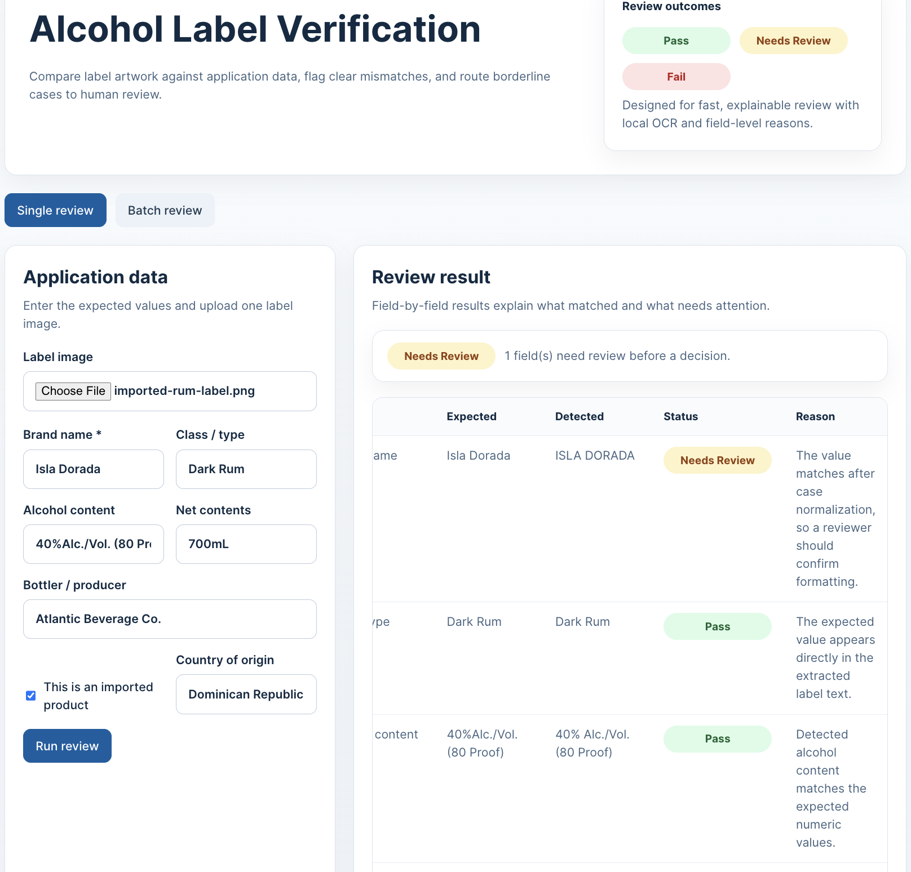
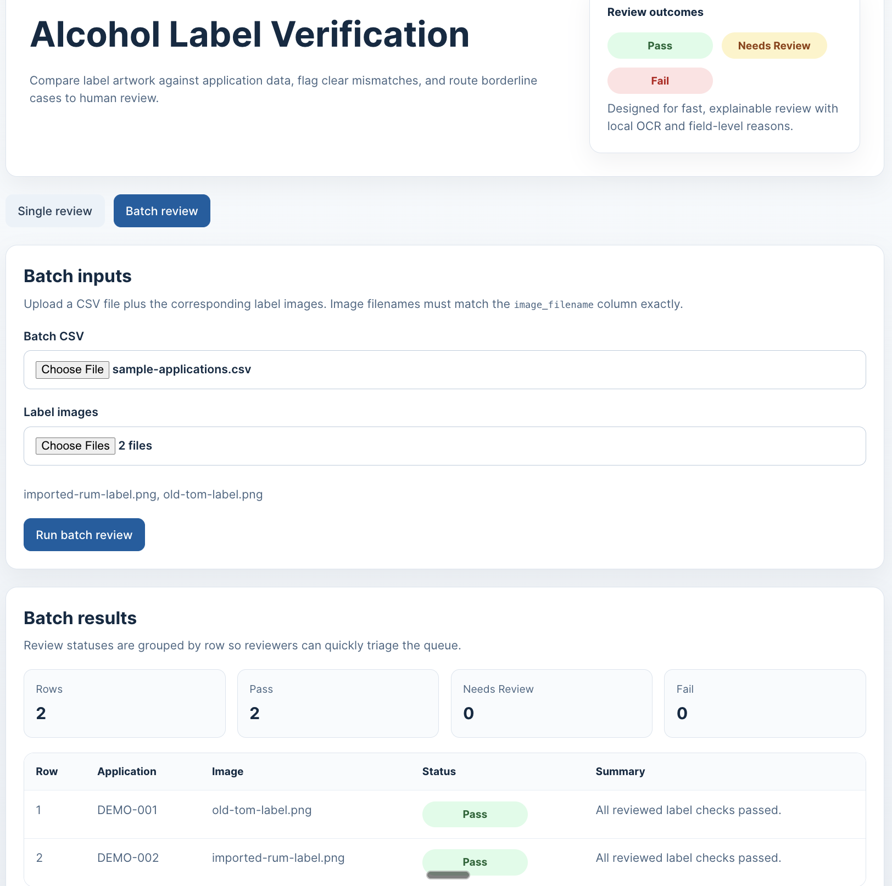

# AI-Powered Alcohol Label Verification App

A standalone prototype for compliance reviewers that compares expected alcohol label data against uploaded label artwork using local OCR and rule-based validation.

## Live application

**Live URL:** https://alcohol-label-verifier-12lu.onrender.com/

## Version 1 screenshots

### Version 1 single review



### Version 1 batch review



## What it does

- Reviews a single label image against manually entered application data
- Runs local OCR with image preprocessing
- Validates common TTB-style fields:
  - brand name
  - class/type
  - alcohol content
  - net contents
  - bottler/producer
  - country of origin for imports
  - government warning
- Supports batch review with CSV + image uploads
- Returns **Pass**, **Needs Review**, or **Fail** with field-level reasons

## Tech stack

- **Frontend:** React + Vite + TypeScript
- **Backend:** FastAPI + Python
- **OCR:** Tesseract via `pytesseract`
- **Image preprocessing:** OpenCV
- **Deployment:** Single-container Docker image that serves both API and frontend

## Local development

### Prerequisites

- Node.js 19+ for local Vite development
- Python 3.11+
- Tesseract OCR installed locally

On macOS with Homebrew:

```bash
brew install tesseract
```

### Backend

```bash
cd backend
python -m venv .venv
source .venv/bin/activate
pip install -r requirements.txt
uvicorn app.main:app --reload
```

The API runs on `http://localhost:8000`.

### Frontend

```bash
cd frontend
npm install
npm run dev
```

The frontend runs on `http://localhost:5173` and proxies API calls to the backend.

## Docker

To run the full app in a single container:

```bash
docker compose up --build
```

The combined app will be available at `http://localhost:8000`.

## Batch CSV format

The batch endpoint expects a CSV file with at least:

- `image_filename`
- `brand_name`

Supported optional columns:

- `application_id`
- `class_type`
- `alcohol_content`
- `net_contents`
- `bottler`
- `country_of_origin`
- `imported`

See `sample-data/sample-applications.csv` for an example.

## Assumptions and tradeoffs

- This is a **standalone prototype**, not a COLA integration
- OCR is local-first to avoid dependence on blocked outbound ML endpoints
- The app preserves human review by returning **Needs Review** for borderline matches
- Government warning validation is strong on wording and capitalization, but the prototype does **not** reliably validate bold styling
- Image quality still matters; preprocessing helps, but poor scans and glare can still reduce accuracy

## Validation

### Frontend

```bash
cd frontend
npm run lint
npm run build
```

### Backend

```bash
cd backend
pytest
```

## Deployment

The repository includes:

- a root `Dockerfile` for a single-service deployment
- `docker-compose.yml` for local container runs
- a GitHub Actions workflow for frontend lint/build and backend tests

Suitable deployment targets include Render, Railway, or Fly.io using the root Dockerfile.

### Render

The repository includes `render.yaml` for a Docker-based web service on Render.

1. Create a new **Blueprint** or **Web Service** in Render
2. Point it at `mcooperstein/alcohol-label-verifier`
3. Let Render build from the root `Dockerfile`
4. Use `/api/health` as the health check path
